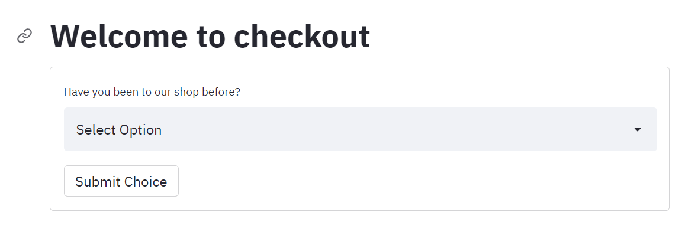
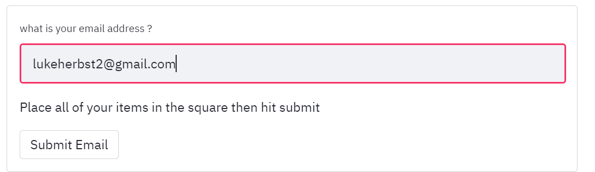
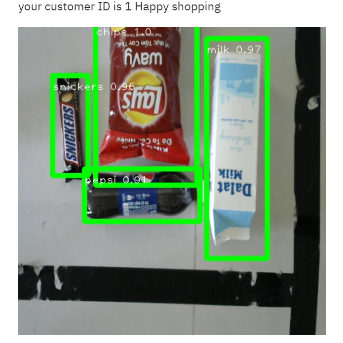
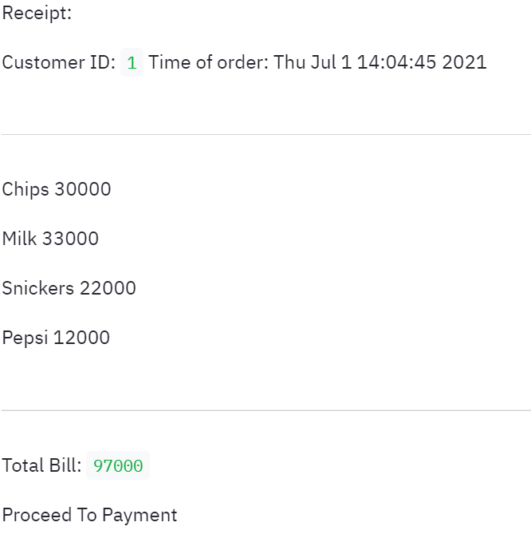
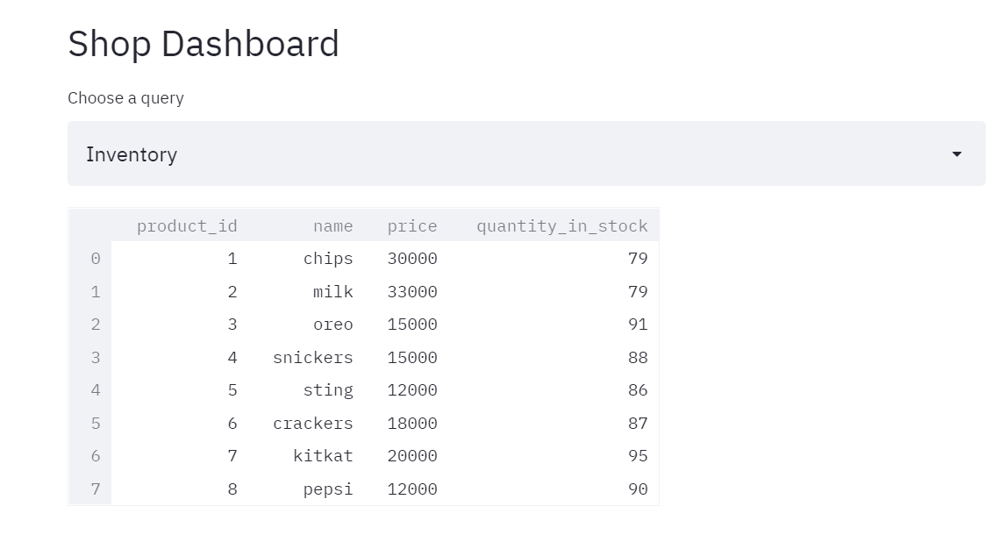

# autocheckout_yolo
An automated checkout for shops, My final project for a machine learning bootcamp at Coderschool Vietnam

This project uses SQlite3, OpenCV and a custom trained yolov4 Tiny model to check for products using a webcam and produces a receipt and also updates the database.

## files 
The only file that needs to be executed is Streamlit2.py
to run this file from the terminal: streamlit run stremlit2.py

other files:
database.py contains all the funtions and classes related to the database
computer_vision.py  contains the funtions related to reading the image and object detection
data.py contains all the lists dictionaries and files required for the program

the .weights and .cfg files are from the yolv4tiny that was trained in a seperate colab notebook using a Robloflow tutorial. 

## the homepage

## submit info and open camera

## Prediction display 

## Receipt

## Database

